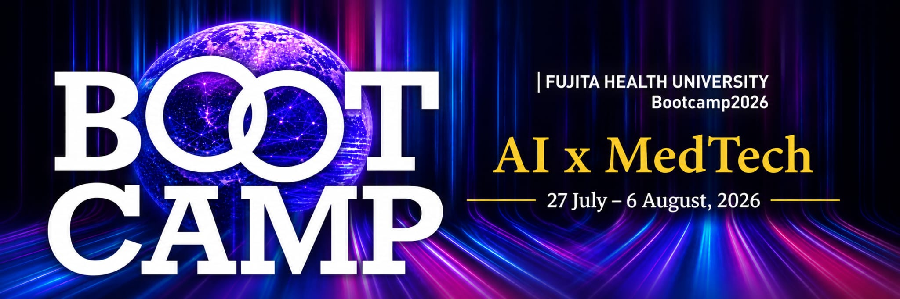

# Hi there, I'm Vipul Kumar 👋

### Software Engineer • Machine Learning Researcher

[🇺🇸 English](./README.md) | [🇯🇵 日本語](./README.ja.md)

🎓 M.Eng. Student in AI Life Design @ **Kyushu Institute of Technology, Japan**

Building intelligent systems at the intersection of **Machine Learning**, **Healthcare AI**, and **Software Engineering**.

---

## 👨‍💻 About Me

I'm a Master's student in **Human Intelligence Systems** at **Kyushu Institute of Technology** with **3+ years of professional software engineering experience** building enterprise applications before transitioning into AI research.

My work focuses on developing **intelligent healthcare systems** using **Machine Learning**, **Human Activity Recognition**, and **Large Language Models**. I enjoy building reproducible research pipelines with the same engineering practices used in production software.

---

## 🔬 Research Interests

- 🧠 Human Activity Recognition (HAR)
- 🎧 Audio Activity Recognition
- 🏥 Healthcare AI
- 🤖 Large Language Models
- 🔍 Explainable AI
- 🦴 Pose Estimation
- 🔒 Privacy-Preserving AI
- 📊 Feature Engineering

---

## 🚀 Featured Projects

| Project | Description |
|---------|-------------|
| 🧠 **Human Activity Recognition** | Machine learning pipeline for recognizing human activities from 2D pose estimation using feature engineering and subject-independent evaluation. |
| 🎧 **CareSoundAI** | Privacy-preserving Android application for elderly monitoring using environmental audio recognition and local LLM explanations. |
| 💼 **Job Alert** | Automated platform that monitors Japanese job websites and sends real-time Discord notifications. |
| 🐄 **Ushi Facts** | Serverless Python application that automatically posts bilingual AI facts to Discord using GitHub Actions. |

---

## 🏕️ Healthcare Innovation Bootcamp

  <!-- BOOTCAMP BANNER PLACEHOLDER -->
  

**Fujita Hospital · Summer 2026 · Japan**

A 10-day healthcare innovation bootcamp focused on Design Thinking,
AI-assisted innovation, user research, rapid prototyping, and
validation in a healthcare environment.

### 🧠 What I Learned

The bootcamp introduced a structured Design Thinking process:

| Discover | Define | Ideate | Prototype | Validate |
|----------|--------|--------|-----------|----------|
| Observation | 5 Whys | Crazy 8s | Rapid Prototyping | User Testing |
| Interviews | Empathy Maps | Storyboarding | Low-fidelity UX | Feedback |
| AEIOU | Journey Maps | Decision Sprints | Iteration | Validation Grid |
| Opportunity Mapping | HMW Questions | — | — | Impact / Effort |

### 🛠️ What I Built

**Rehabilitation Progress Visualizer**

A therapist-guided healthcare application designed to make
rehabilitation progress visible and understandable to patients.

The prototype represents rehabilitation as a journey across Japan,
where achieving rehabilitation milestones progressively moves the
patient from **Hokkaido → Tokyo**.

### 🔄 From Idea to Prototype

**🌸 Initial Concept: Japanese Garden**

Progress was represented through a garden that became richer as
rehabilitation milestones were achieved.

⬇️ **User Validation**

The visual approach was well received, but users did not always
understand where the journey was leading.

⬇️ **Design Iteration**

**🗾 Current Concept: Japan Journey**

The garden metaphor was replaced with a journey that communicates
both **progress and direction**.

### 👥 My Contributions

- Contributed to prototype development and implementation
- Worked on UI/UX iteration
- Incorporated patient and therapist feedback
- Helped translate rehabilitation milestones into visual experiences
- Contributed to testing and refinement

### 💡 Key Takeaway

> Building healthcare technology isn't only about the technology itself.
> Understanding users, validating assumptions, and iterating based on
> feedback are equally important.

---

## 💻 Tech Stack

### Languages

### Machine Learning

### Backend & Databases

### Tools

---

## 🧪 Research & Engineering

<table>
<tr>
<td valign="top" width="50%">

### 🔬 Research

- Human Activity Recognition
- Pose-based Activity Recognition
- Audio Activity Recognition
- Feature Engineering
- Explainable AI
- Experimental Evaluation
- Hyperparameter Optimization
- Machine Learning Pipelines

</td>

<td valign="top" width="50%">

### ⚙️ Software Engineering

- REST APIs
- Microservices
- ASP.NET Core
- Python Automation
- Web Scraping
- System Design
- GitHub Actions
- Enterprise Software Development

</td>
</tr>
</table>

---

## 💼 Professional Experience

**Senior Software Engineer**  
**IDEMIA**

- Enterprise biometric systems
- Desktop & web application development

**Software Consultant**  
**NashTech**

- REST APIs
- .NET
- Angular
- SQL
- Unit Testing

**Software Developer**  
**Nagarro**

- Enterprise web applications
- Accessibility engineering

---

## 🎓 Education

**Master of Engineering**

Human Intelligence Systems

📍 Kyushu Institute of Technology, Japan

---

**Bachelor of Technology**

Electronics & Communication Engineering

Bharati Vidyapeeth's College of Engineering

---

## 🌱 Currently Learning

- Human Activity Recognition
- Explainable AI
- Healthcare AI
- Edge AI
- Japanese 🇯🇵

---

## 📈 GitHub Statistics

  

  

---

## 🤝 Let's Connect

📧 **Email:** vipulchaudhary64@gmail.com

💼 **LinkedIn:** https://www.linkedin.com/in/vipulkumar90/

---

> *"I enjoy building intelligent systems that bridge academic research and production-quality software."*

